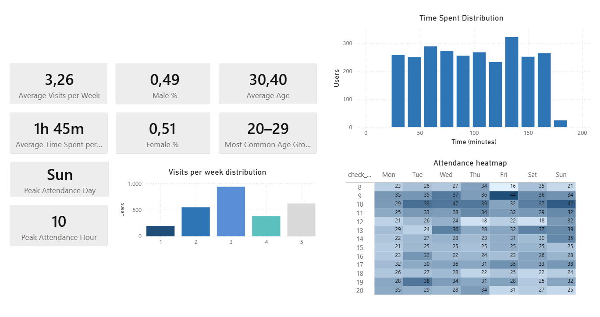

## 🚧 Project Status

This project is currently **in progress**.
___

# 📁 Exploratory Data Analysis of Gym Member Behavior
This project explores gym member behavior through data cleaning, feature engineering, and visual analytics. The analysis focuses on age distribution, gender patterns, weekly visit frequency, attendance trends by day and hour, and service usage using Power BI.
___

## 📌 Data Source
The analysis is based on the [Gym Membership Dataset](https://www.kaggle.com/datasets/ka66ledata/gym-membership-dataset) available on Kaggle.

___

## 📊 Dataset Content
The dataset contains detailed information about gym members and their behavioral patterns. Key fields include:

🆔 id — Unique member identifier

🚻 gender — Member gender

🎂 birthday / age — Demographic information

💳 subscription_type — Membership plan

📅 visits_per_week — Weekly gym attendance

🗓️ days_per_week — Typical training days

👥 group_lesson_attendance — Participation in group classes

⭐ favorite_lessons — Preferred group lessons

⏰ check_in_time / check_out_time — Entry and exit times

⏱️ avg_time_in_gym — Average session duration

🥤 drink_subscription — Drink plan usage

🍹 favorite_drink — Preferred drink

🏋️ personal_training — Personal training usage

👨‍🏫 trainer_name — Assigned trainer

🔥 sauna_usage — Sauna usage frequency
____

## 🧭 Project Overview
The goal of this project is to understand how gym members use the facilities and services. Through exploratory data analysis, the project identifies behavioral patterns that can support operational decisions, resource planning, and customer experience improvements.
____

## 🔧 Methodology
📌 1. Data Preparation
   └─ Cleaning and transforming raw data using Power Query
      • Fixed data types
      • Removed inconsistencies
      • Standardized formats

📌 2. Feature Engineering
   └─ Creating analytical fields with DAX
      • Time‑based metrics
      • Behavioral indicators

📌 3. Time-Based Analysis
   └─ Understanding member activity patterns
      • Check‑in / check‑out trends
      • Attendance heatmap by day & hour

📌 4. Behavioral Segmentation
   └─ Identifying usage patterns
      • Visits per week
      • Days attended
      • Member behavior clusters

📌 5. Service Usage Analysis
   └─ Evaluating engagement with gym services
      • Personal training
      • Sauna usage
      • Group lessons

📌 6. Dashboard Development
   └─ Building an interactive

___
##  📊 Dashboard Overview

### ⭐ Key Behavioral Insights

1. Members show a stable weekly routine
Most users visit the gym 3 times per week, which aligns with typical fitness engagement patterns. This suggests a healthy retention level and a consistent user base.

2. Time spent per visit indicates strong engagement
With an average session duration of 1h 45m, members are not just checking in—they are actively training. This is above industry averages (usually 60–90 minutes), indicating high facility usage.

3. Attendance peaks on Sundays at 10:00
The peak day (Sunday) and peak hour (10 AM) reveal a strong preference for weekend morning workouts.

### ⭐ Demographic Insights

4. Gender distribution is balanced
The gym has a near 50/50 split between male and female members.
This balance allows for neutral marketing strategies and diverse class offerings.
